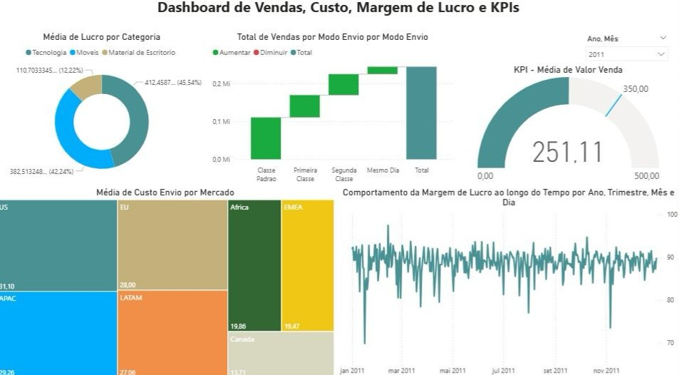

# 📊 Dashboard de Performance: Vendas, Custos ,Margem de Lucro e KPIs
### Projeto Prático de Modelagem de Dados: Excel para Power BI

## Objetivo do Projeto
Este dashboard foi desenvolvido como um **projeto prático para fins de estudo**, com o objetivo principal de dominar a **Modelagem de Dados** no Power BI. O foco foi estruturar bases de dados provenientes do Excel e transformá-las em um modelo relacional eficiente para análise de KPIs financeiros e logísticos.

## Foco em Aprendizado (Modelagem)
A maior parte do esforço técnico foi dedicada à estruturação do modelo:
*   **Transformação de Dados:** Aplicação de limpeza e padronização (Processo POP) via Power Query.
*   **Arquitetura Star Schema:** Organização de tabelas Dimensão (Clientes, Pedidos, Produtos) e tabelas Fato (Vendas) para otimizar filtros.
*   **Lógica de Negócio:** Tradução de necessidades gerenciais em fórmulas DAX (Cálculos de Lucro, Margem e Metas).

##  Ferramentas e Processos
*   **Bases de Dados:** 4 planilhas Excel integradas (Clientes, Pedidos, Produtos e Vendas).
*   **Desenvolvimento:** Power BI Desktop.
*   **Técnicas:** ETL, Modelagem Relacional, DAX e Data Visualization.

##  Questões Analisadas
O projeto simula a resolução de problemas reais de uma operação:
1.  Distribuição de vendas por modo de envio.
2.  Mercados com maior custo médio de frete.
3.  Acompanhamento de meta mensal de faturamento (Meta: **350k**).
4.  Rentabilidade e lucro médio por categoria de produto.
5.  Evolução histórica da margem de lucro ao longo do tempo.
   

